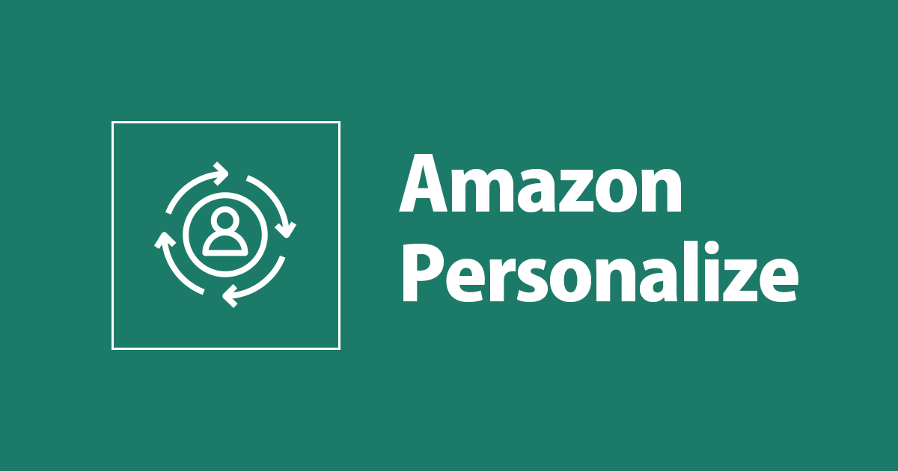
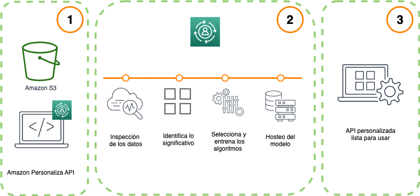
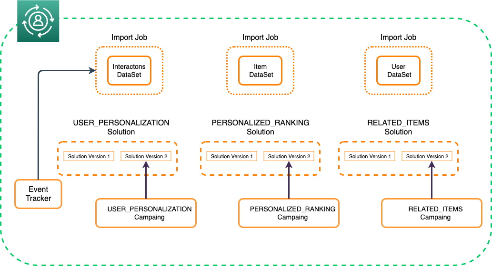
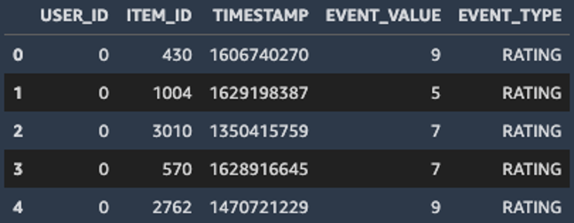
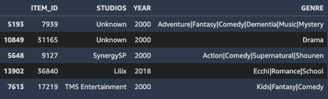
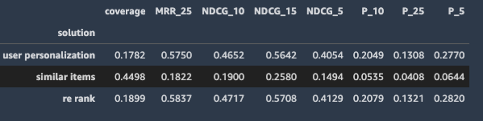
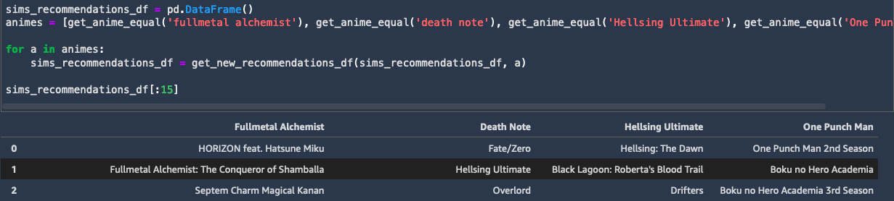
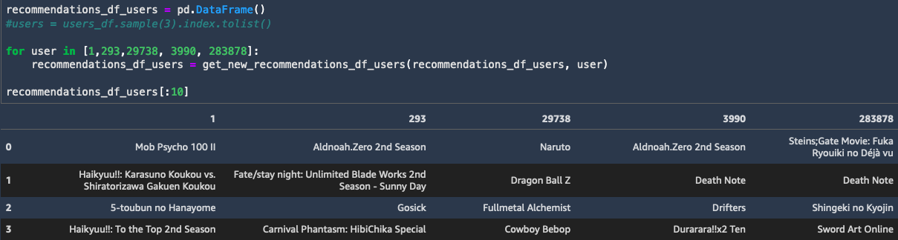
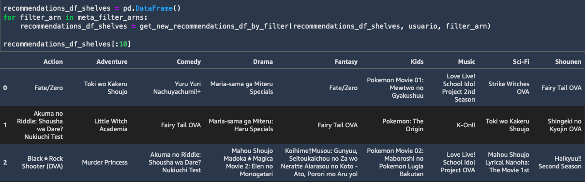

# Recomendador de Anime utilizando Amazon Personalize. 



1. [Descarga de Dataset Kaggle](https://github.com/aws-samples/aws-recomendador-anime/blob/main/recomendador-de-anime/01_Descarga_Dataset.ipynb)
2. [Exploracion y Preparación](https://github.com/aws-samples/aws-recomendador-anime/blob/main/recomendador-de-anime/02_Exploracion_Prepariacion.ipynb)
3. [Crear las soluciones](https://github.com/aws-samples/aws-recomendador-anime/blob/main/recomendador-de-anime/03_Creacion_Soluciones.ipynb)
4. [Despliegue de Campañas](https://github.com/aws-samples/aws-recomendador-anime/blob/main/recomendador-de-anime/04_Desplegando_campanas.ipynb)
5. [Probar Recomendaciones](https://github.com/aws-samples/aws-recomendador-anime/blob/main/recomendador-de-anime/05_Probando_Recomendaciones.ipynb)
6. [Limpiar el proyecto](https://github.com/aws-samples/aws-recomendador-anime/blob/main/recomendador-de-anime/06_Clean_Up_Resources.ipynb)

## Introducción

Cada vez los motores de recomendación están cobrando relevancia en los sistemas para personalizar la experiencia del usuario y hacerla más relevante. Ejemplos son la publicidad, recomendaciones en plataforma de Video On Demand, o sugerencias de nuevos contactos en redes sociales. 

Bien ejecutado un modelo de personalización puede aumentar las ganancias de una empresa o disminuir los costos, pero por el contrario, si se hace mal, termina en una mala experiencia de cliente.

Una de las dificultades de estos proyectos es que requieren conocimientos y experiencia avanzada en Machine Learning (cosa que no todos pueden tener a la mano), por lo que una opción es el servicio de [Amazon Personalize](https://aws.amazon.com/es/personalize/) que brinda de alguna manera un "servicio de motor de recomendaciones con tus propios datos", haciendo todo el proyecto muchísimo más abordable y donde se pueden ver los resultados rápidamente.

Si bien, no necesitas ser un experto en Machine Learning (ML) para crear y ejecutar proyectos con [Amazon Personalize](https://aws.amazon.com/es/personalize/) es recomendables que tengas conocimientos básicos, para esto puedes revisar en el blog Introduccion a Machine Learing.

En este blog basado [Personalize POC Guide](https://github.com/aws-samples/amazon-personalize-samples/tree/master/next_steps/workshops/POC_in_a_box) vamos a utilizar el servicio de [Amazon Personalize](https://aws.amazon.com/es/personalize/) para entrenar motores de recomendación con los datos de [Recommendation Database 2020](https://www.kaggle.com/datasets/hernan4444/anime-recommendation-database-2020) de [kaggle](https://www.kaggle.com/), utilizando las interacciones que han tenido los usuarios con los animes, como también la otros datos disponibles como Genero y Calificación.

Manos a la obra.


## [Amazon Personalize:](https://aws.amazon.com/es/personalize/) 

Es un servicio basado en la misma tecnología ML utilizada por la tienda [www.amazon.com](http://www.amazon.com/) que permite entrenar modelos de personalización y obtener recomendaciones en tiempo real.

Genera recomendaciones de gran relevancia utilizando técnicas de [Deep Learning](https://quip-amazon.com/2csdApMd5Ck6) y no requiere tener la experiencia o conocimientos avanzados en ML. 

## Y...¿Como Funciona?

 

1. Debes proporcionar datos sobre usuarios y elementos para realizar la personalización.

Los datos que utilizamos para modelar en Personalize son de tres tipos:

**Interaction DataSet(obligatorio)**:consiste en el momento en el que usuario interactuó con un ítem, por ejemplo clicks, compras, visualización, calificación. Es el único Dataset obligatorio. 

**Item DataSet (opcional)**: contiene información adicional de los ítems, tales como categoría o genero. 

**Usuarios (opcional)**: contiene información de los usuarios como edad o sexo. 

2. Detrás de cámaras, Amazon Personaliza automáticamente:

- Inspecciona los datos
- Identifica lo que es significativo
- Selecciona los algoritmos adecuados
- Entrena y optimiza modelos de personalización

3. Después del entrenamiento se obtiene un modelo entrenado que se puede desplegar para hacer inferencias a través de una API.

El proyecto: Recomendador de Anime.

Los pasos a seguir para llevar a cabo este proyecto son:

1. Descargar datos de Kaggle. 
2. Crear un DatasetGroup.
3. Creación de Esquemas y Datasets.
4. Importación de los datos para uso de Amazon Personalize (https://aws.amazon.com/es/personalize/) .
5. Seleccionar un algoritmo (recipe), crear una “Solution” y “Solution version” (modelo entrenado).
6. Crear un endpoint de inferencias (Campaña).
7. Creación de un Event Tracker (para actualizar los DataSets).
8. Opcionales: Creación de Filtros.

## Pre-requisitos

Para realizar proyecto, debe tener los siguientes requisitos previos:

* Una [Cuenta AWS](https://signin.aws.amazon.com/signin?redirect_uri=https%3A%2F%2Fportal.aws.amazon.com%2Fbilling%2Fsignup%2Fresume&client_id=signup)
* AWS resources
* Software para correr Jupyter Notebooks. 
* Conocimientos en Python. 


 


Los pasos a seguir para llevar a cabo este proyecto son:

1. Descargar datos de Kaggle. 
2. Crear un DatasetGroup.
3. Creación de Esquemas y Datasets.
4. Importación de los datos para uso de Amazon Personalize (https://aws.amazon.com/es/personalize/) .
5. Seleccionar un algoritmo (recipe), crear una “Solution” y “Solution version” (modelo entrenado).
6. Crear un endpoint de inferencias (Campaña).
7. Creación de un Event Tracker (para actualizar los DataSets).
8. Opcionales: Creación de Filtros.
9. Resultados.
10. Borrar los recursos de la cuenta de AWS.


## Paso 1: Descargar datos de Kaggle.

El [01_Descarga_Dataset.ipynb](https://github.com/aws-samples/aws-recomendador-anime/blob/main/recomendador-de-anime/01_Descarga_Dataset.ipynb) para descargar los datos de [Recommendation Database 2020](https://www.kaggle.com/datasets/hernan4444/anime-recommendation-database-2020) de [kaggle](https://www.kaggle.com/):

```python 
!pip3 install kaggle
data_dir = "anime-data"
dataset_name =  "hernan4444/anime-recommendation-database-2020"
!mkdir $data_dir
!kaggle datasets download -p {data_dir}/ --unzip {dataset_name}
```
Una vez descargados los puedes explorar en el notebook [02_Exploracion_Prepariacion.ipynb]( )

## Paso 2: Crear un DataSet Group

El Dataset Group es donde están todos los recursos (no solo los datasets). Puedes crear varios Dataset Groups y tus modelos no se van topar entre sí.

Por ejemplo, es posible que tenga una aplicación que proporciona recomendaciones para la transmisión de vídeo y otra que recomienda libros de audio. 

En Amazon Personalize, cada aplicación tendría su propio grupo de conjuntos de datos. 

Y en nuestro GitHub seria estas lineas del notebook [03_Creacion_Soluciones.ipynb]( ):

```python 
create_dataset_group_response = personalize.create_dataset_group(
    name = "personalize-anime"
)
dataset_group_arn = create_dataset_group_response['datasetGroupArn']
```

## Paso 3: Creación de un conjunto de datos y un esquema

Debemos crear el conjunto de datos, y su esquema. 

El esquema en Amazon Personalize (https://aws.amazon.com/es/personalize/) permite analizar los datos.

Para el recomendador de anime utilizaremos dos conjuntos de datos: 


* Interaction DataSet
* Items DataSet


*Interaction DataSet*

Lo creamos procesando a *anime.csv* y *rating_complete* en el notebook [02_Exploracion_Prepariacion.ipynb](https://github.com/aws-samples/aws-recomendador-anime/blob/main/recomendador-de-anime/02_Exploracion_Prepariacion.ipynb)

Podemos ver que costa de 5 columnas 3 de ellas requeridas: 

* USER_ID (ID del usuario - Requerido)
* ITEM_ID (ID del anime - Requerido) 
* TIMESTAMP (cuando ocurrió esta evaluación - Requerido)
* EVENT_VALUE (valor obtenido por el anime - Opcional).
* EVENT_TYPE (tipo del valor, en este caso rating - Opcional)


 
El esquema se crea con las siguientes lineas de código:

```python
interactions_schema = schema = {
    "type": "record",
    "name": "Interactions",
    "namespace": "com.amazonaws.personalize.schema",
    "fields": [
        {
            "name": "USER_ID",
            "type": "string"
        },
        {
            "name": "ITEM_ID",
            "type": "string"
        },
        {
            "name": "TIMESTAMP",
            "type": "long"
        },
        {
            "name": "EVENT_VALUE",
            "type": "float"
        },
        {
            "name": "EVENT_TYPE",
            "type": "string"
        },

    ],
    "version": "1.0"
}

create_schema_response = personalize.create_schema(
    name = "personalize-anime-interactions1",
    schema = json.dumps(interactions_schema)
)
```

*Items DataSet*

Lo creamos procesando a *item-meta.csv* el notebook  [*02_Exploracion_Prepariacion.ipynb*](https://github.com/aws-samples/aws-recomendador-anime/blob/main/recomendador-de-anime/02_Exploracion_Prepariacion.ipynb)

* ITEM_ID (ID del anime - Requerido)
* STUDIOS (estudio que lo creo - Opcional)
* YEAR (año de su lanzamiento -Opcional)
* GENRE (géneros - Opcional)




En la creación del esquema los atributos adicionales deben tener categorical = true, de lo contrario no son tomados en cuenta para entregar el modelo, estas características adicionales las podemos usar para crear filtros, ya hablaremos de los filtros. 

El esquema se crea con las siguientes lineas de código:


```python
importitemmetadata_schema = {
    "type": "record",
    "name": "Items",
    "namespace": "com.amazonaws.personalize.schema",
    "fields": [
        {
            "name": "ITEM_ID",
            "type": "string"
        },
        {
            "name": "STUDIOS",
            "type": "string",
            "categorical": True
        },
        {
            "name": "YEAR",
            "type": "int",
        },
        {
            "name": "GENRE",
            "type": "string",
            "categorical": True
        },

        
    ],
    "version": "1.0"
}
```


## Paso 4: Importación de los datos

Ahora estarás listo para importar los datos de entrenamiento a [Amazon Personalize](https://aws.amazon.com/es/personalize/). 

Al importar los datos, puedes optar por importar registros en bloque, importar registros individualmente o ambos, según los requisitos del negocio y la cantidad de datos históricos recopilados. 

Indistintamente deben estar en un bucket en S3 con permisos para [Amazon Personalize](https://aws.amazon.com/es/personalize/).

Previa a la importación, los datos deben estar en el formato correcto ([Formatear los datos](https://docs.aws.amazon.com/es_es/personalize/latest/dg/data-prep-formatting.html)) y deben estar en un bucket de S3 ([Cargar a un bucket de S3](https://docs.aws.amazon.com/es_es/personalize/latest/dg/data-prep-upload-s3.html)). 

La importación de los datos lo podemos hacer de forma masiva creando un import jobs: 


```python
create_dataset_import_job_response = personalize.create_dataset_import_job(
    jobName = "personalize-anime-item-import",
    datasetArn = items_dataset_arn,
    dataSource = {
        "dataLocation": "s3://{}/{}".format(bucket_name, itemmetadata_filename)
    },
    roleArn = role_arn
)

dataset_import_job_arn = create_dataset_import_job_response['datasetImportJobArn']
```

El código completo lo pedes ver en el notebook [02_Exploracion_Prepariacion.ipynb](https://github.com/aws-samples/aws-recomendador-anime/blob/main/recomendador-de-anime/02_Exploracion_Prepariacion.ipynb). 

## Paso 5: Creación de la solución

La solución hace referencia a la combinación de una receta de Amazon Personalize (https://aws.amazon.com/es/personalize/), parámetros personalizados y una o más versiones de la solución. 

Una vez creada la Version Solution, la solución con mejor desempeño, creas la campaña y obtienes las recomendaciones.

En nuestro repo de GitHub la solución la creamos en el notebook [03_Creacion_Soluciones.ipynb](https://github.com/aws-samples/aws-recomendador-anime/blob/main/recomendador-de-anime/03_Creacion_Soluciones.ipynb)

Sigue lo siguiente para crear las soluciones:

***1- Elija un recipe:*** Un recipe un término de [Amazon Personalize](https://aws.amazon.com/es/personalize/) que especifica un algoritmo apropiado para entrenar para un caso de uso determinado.

Los recipe son algoritmos preparados para casos de uso específicos que te permite crear un sistema de personalización sin experiencia previa en aprendizaje automático.

Amazon Personalize proporciona 3 tipos de recipe:

User personalization: cosiste en un modelo al cual le paso un usuario y me entrega un listado de ítems recomendados para ese usuario.

Personalized Ranking: cosiste en un modelo al cual paso un usuario y un listado de ítems y me los entrega ordenados de acuerdo a la preferencia de ese usuario.

Similar items: Se basa en el concepto de filtrado colaborativo, si otro usuario compra el mismo articulo que tu, entonces el modelo te recomienda artículos que ese otro usuario ha comprado.

Más información: [aquí](https://docs.aws.amazon.com/es_es/personalize/latest/dg/working-with-predefined-recipes.html)

Se crean con las siguientes lineas de código, se repite para cada recipe: 

```python
#Se crea el recipe
user_personalization_create_solution_response = personalize.create_solution(
name = "personalize-anime-userpersonalization",
datasetGroupArn = dataset_group_arn,
recipeArn = user_personalization_recipe_arn
)
user_personalization_solution_arn = user_personalization_create_solution_response['solutionArn']

```

***2. Creación de una versión de solución (entrene un modelo):***  1. Entrena el modelo de aprendizaje automático que [Amazon Personalize](https://aws.amazon.com/es/personalize/) e utilizará para generar recomendaciones para tus clientes.

Se crea una version de la solución para cada recipe con las siguientes lineas de codigo: 

```python
user_personalization_create_solution_version_response = personalize.create_solution_version(
    solutionArn = user_personalization_solution_arn
)

user_personalization_solution_version_arn = user_personalization_create_solution_version_response['solutionVersionArn']
```

Esto tarda por lo que el código tiene un loop donde te informa el estado cada 60 segundos: 
```python
in_progress_solution_versions = [
    userpersonalization_solution_version_arn,
    sims_solution_version_arn,
    rerank_solution_version_arn
]

max_time = time.time() + 10*60*60 # 10 hours
while time.time() < max_time:
    for solution_version_arn in in_progress_solution_versions:
        version_response = personalize.describe_solution_version(
            solutionVersionArn = solution_version_arn
        )
        status = version_response["solutionVersion"]["status"]
        
        if status == "ACTIVE":
            print("Build succeeded for {}".format(solution_version_arn))
            in_progress_solution_versions.remove(solution_version_arn)
        elif status == "CREATE FAILED":
            print("Build failed for {}".format(solution_version_arn))
            in_progress_solution_versions.remove(solution_version_arn)
    
    if len(in_progress_solution_versions) <= 0:
        break
    else:
        print("At least one solution build is still in progress")
        
    time.sleep(60)

 ```
   

***3. Evaluar la versión de solución:*** Una vez tengamos listas las versiones, debemos evaluar si es la mas adecuada, para eso personalize deja una parte de la data fuera del entrenamiento que usa para probarlo.

Y nos entrega el siguiente cuadro con la evaluación:




*Coverage* es el porcentaje de los items que el modelo está recomendando en general. Es decir por ejemplo en SIMS, tiene un coverage de 45% es decir hay un 55% de items que no están siendo recomendados.

*Precision* 5, 10 y 25 son las precisión de las recomendaciones por ejemplo si recomiendo 10 items y el usuario interactuá con 2, mi precision a 10 es de 20%

*Normalized discount gain* 5,10 y 25 es muy similar a precisión pero acá el orden importa, y hay incentivo por entregar las recomendaciones en orden real de interacción

Si quieres mejorar el coverage debes garantizar que el modelo tenga en cuenta los ítems nuevos y los antiguos con poca preferencia, esto lo puedes modificar seteando el parametro *campaignConfig* al crear la campaña.

Más Información: [https://boto3.amazonaws.com/v1/documentation/api/latest/reference/services/personalize.html#Personalize.Client.create_campaign](https://boto3.amazonaws.com/v1/documentation/api/latest/reference/services/personalize.html#Personalize.Client.create_campaign)


## Paso 6: Crear un endpoint de inferencias (Campaña)

Seleccionada la Version Solution con el mejor desempeño creamos la campaña para cada recipe y las desplegamos ejecutando el [04_Desplegando_campanas.ipynb](https://github.com/aws-samples/aws-recomendador-anime/blob/main/recomendador-de-anime/04_Desplegando_campanas.ipynb). 

Las lineas que crean la campañas son: 
 
```python
sims_create_campaign_response = personalize.create_campaign(
    name = "personalize-anime-SIMS",
    solutionVersionArn = sims_solution_version_arn,
    minProvisionedTPS = 1
)
sims_campaign_arn = sims_create_campaign_response['campaignArn']
```

Las campañas pueden demorar un poco en crearse, en el notebook hay un loop para consultar el estado hasta que estén finalmente creadas.

## Paso 7: Creación de un Event Tracker

Amazon Personalize puede hacer recomendaciones basadas en tiempo real, solo con data histórica, o con una mezcla de ambos.

Debemos crear el Event Tracker para que Amazon Personalize pueda aprender de la actividad más reciente del los usuario y actualizar las recomendaciones mientras utilizan la aplicación, mantiene los datos de interacciones actualizados y mejora la relevancia de las recomendaciones.

En el notebook [05_Probando_Recomendaciones.ipynb](https://github.com/aws-samples/aws-recomendador-anime/blob/main/recomendador-de-anime/05_Probando_Recomendaciones.ipynb) lo hacemos con esta lineas de comandos:


```python
response = personalize.create_event_tracker(
    name='AnimeTracker',
    datasetGroupArn=dataset_group_arn
)
```

## Paso 8: Creación de filtros 

Ahora que todas las campañas están implementadas y activas, podemos crear filtros, te permitirán filtrar por una condición del ítem dataset, en nuestro caso haremos un filtro para los géneros, pero también podemos filtrar por campo año o estudio.

```python
createfilter_response = personalize.create_filter(
            name=genre,
            datasetGroupArn=dataset_group_arn,
            filterExpression='INCLUDE ItemID WHERE Items.GENRE IN ("'+ genre +'")'
        )
```

## Paso 9: Resultados

Para ver los resultados trabajamos el notebook [05_Probando_Recomendaciones](https://github.com/aws-samples/aws-recomendador-anime/blob/main/recomendador-de-anime/05_Probando_Recomendaciones.ipynb), donde puedes ver los siguientes resultados.. y además crear los tuyos. 

***Similar Items (SIMS)***



***User Personalization***



***Usando Filtros***




## Paso 10: Borrar los recursos de la cuenta de AWS.

Si ya terminaste de explorar los resultados del Recomendador de Anime, puedes limpiar los recursos de la cuenta de AWS siguiendo los pasos en el notebook [06_Clean_Up_Resources.ipynb](https://github.com/aws-samples/aws-recomendador-anime/blob/main/recomendador-de-anime/06_Clean_Up_Resources.ipynb). 


# Fuentes adicionales

Developer Guide : https://docs.aws.amazon.com/es_es/personalize/
